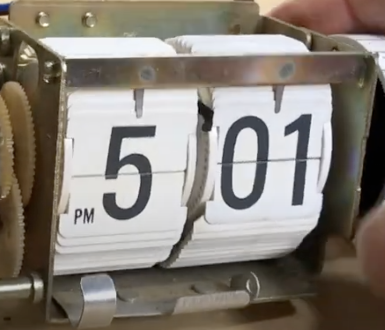
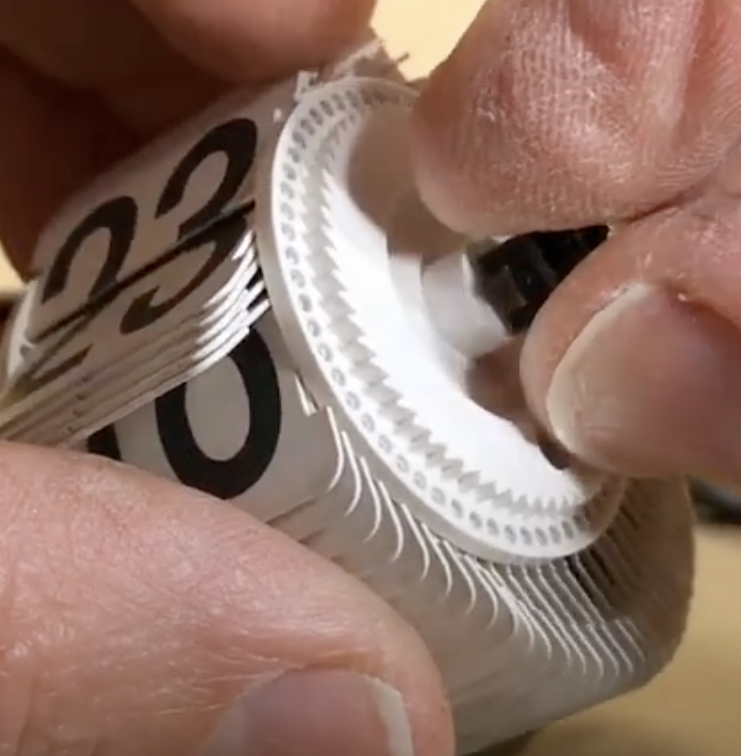
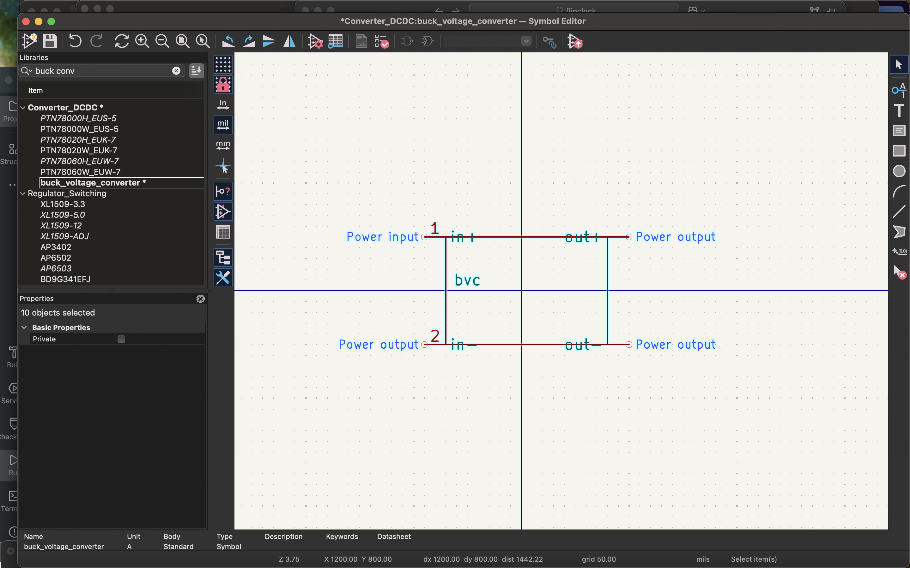
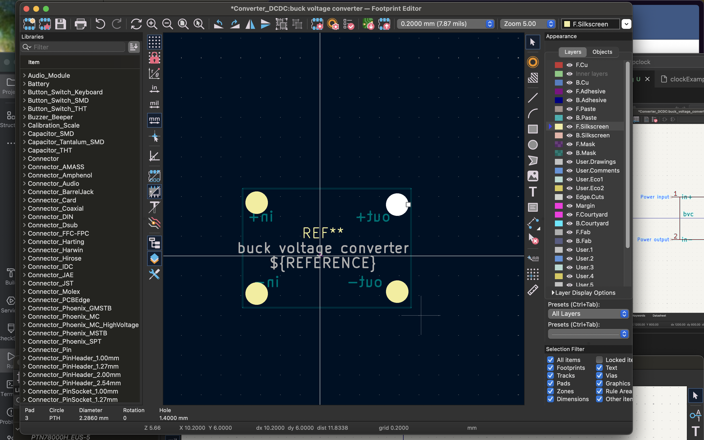

# day 0
## initial design
- i plan to use two stepper motors attached to a pcb ßwith a wifi board that recieves a number and sets its two digits to that number. it will be all in a case, and the there will be two wheels with digits from 1-10 on them on the stepper motors, with there being a little piece of plastic/metal sticking out in the front that keeps the digits in place. it will look a little like this:

every time the missing assignments increase, the motor will turn with just enough force so that the next number flips over. the turning wheels should look like this, but with numbers from 1-10.

the wheels should have a hole in them that fits snugly on the motor shaft.

## checklist
- [ ] pcb
    - esp32 module with external button to turn on and off and way of sending signal to stepper motor, while also keeping track of what number the clock is on at the moment. (could be done through server? that number needs to be persistent and i have no idea how to store stuff permanently/on disk on a microcontroller. OR could just flip the numbers to 00 everytime its turned off and just get the number from the server to put itself back every time it turns on. hmmmmm). might add some more stuff, like a status light or some other small things if im going through the trouble of getting a pcb anyways
- [ ] case
    - still unsure as to what to do for the case - needs to house the motors and pcb and battery, and most important, needs the thing sticking out in front (frame)
- [ ] finding materials
    - motors
    - material for case? (probably pla filament)
    - microcontroller
    - battery
- [ ] software
    - need some sort of software SOMEWHERE that scrapes my school's assignment website (blackbaud) and gets my assignments and sends over a number to the local pcb.
    - will probably use nest to expose an api. but i need to use chromedriver, or some sort of other headless chrome tool (need to get around google oauth!!) which requires some significant space and computational power, so we will see. i have a working headless chrome tool on my computer with golang specifically for this purpose, that uses a library which promises to be portable and not rely on a locally downloaded chromedriver, i just need to move it to nest - which will probably take some work. preferably i'd run this all locally on the pcb, but raspberry pi 5s are expensive!

### completed on june 1st, whole planning took one hour ish
---
# day 1 Monday, June 1st

- focusing on picking motors and pcb.
after looking at a few options, i'm going with two of these: ([nema stepper motors 17](https://www.aliexpress.com/item/3256803688622110.html?spm=a2g0o.cart.0.0.1b8038daASfC7t&mp=1&pdp_npi=5%40dis%21USD%21USD%2027.05%21USD%2014.29%21%21USD%2014.29%21%21%21%402101c5a417488179109783604ed7c4%2112000036219123362%21ct%21US%216382035295%21%211%210&_gl=1*1oei79p*_gcl_au*MTI1MzM1NzYxNi4xNzQ4ODEzNzIx*_ga*MTQzNTU2ODg5NTI1MTEwMS4xNzQ4NTQ2MDMxMjM4*_ga_VED1YSGNC7*czE3NDg4MTc0NzIkbzIkZzEkdDE3NDg4MTc5MTEkajU0JGwwJGgw))
and these drivers: ([TMC2209 drivers](https://www.aliexpress.com/item/3256803101692305.html?spm=a2g0o.cart.0.0.1b8038daASfC7t&mp=1&pdp_npi=5%40dis%21USD%21USD%208.21%21USD%204.76%21%21USD%204.76%21%21%21%402101ec1a17488179246701218e0dfe%2112000030304714539%21ct%21US%216382035295%21%213%210&_gl=1*qjqlvn*_gcl_au*MTI1MzM1NzYxNi4xNzQ4ODEzNzIx*_ga*MTQzNTU2ODg5NTI1MTEwMS4xNzQ4NTQ2MDMxMjM4*_ga_VED1YSGNC7*czE3NDg4MTc0NzIkbzIkZzEkdDE3NDg4MTc5MTEkajU0JGwwJGgw))
while i COULD go with something with less torque, if i use these motors, i can use metal and ensure that the flipping mechanism doesn't break because it has to push past a bendy tab to flip the digits. the counter will just look a lot better overall.

- so i spent a significant amount of time thinking about what purpose a pcb will have. i decided, while it will keep everything neat, it will also regulate power so that there's only one power source and the power doesn't have to go through the esp32 to the motors.
- note: decided on the esp32 wroom32-D module from ([here](https://www.aliexpress.us/item/3256807824311909.html?algo_pvid=31a56de9-03ed-4e79-ac41-c4a62a4a8fad&algo_exp_id=31a56de9-03ed-4e79-ac41-c4a62a4a8fad-0&pdp_ext_f=%7B%22order%22:%22274%22,%22eval%22:%221%22%7D&pdp_npi=4@dis!USD!26.62!0.99!!!190.11!7.02!@2101effb17488207123748291e2b46!12000043243996096!sea!US!6382035295!ABX&curPageLogUid=nqV9eCp368xo&utparam-url=scene:search%7Cquery_from:#nav-description))
- as for power, i think i'll have to rely on the wall unfortunately. i wanted to use a battery setup, but i don't wanna regularly replace SIX batteries (nor fit them in the design) or splurge on an expensive rechargeable battery. so we're going with a 9V dc jack on the pcb. maybe in the future i'll revise and add a battery pack.
- i also need to decide on a wall adapter
    - because of this, i'll need voltage regulators. 

mostly just found materials, and started pcb. total time ~ 2.5 hrs

---
# day 2, monday, june 2nd
- looking at step down voltage converters for the esp32. thinking of a LM2596S.
- following up on this, i think im just gonna find the voltage converter later ... they're all around the same size and their pins are in the same place so i can just replace the footprint later 
routed all the components. i think everythings okay but i need to fix the voltage converters footprint. and i need to just double check everything. 
- ^^ that was earlier. i am double checking and having trouble with the voltage converters footprint - i need to infer where the pads are from the picture. sucks but oh well
total time - around half an hour
---
# day 3, tuesday, june 3rd
- finally created the stupid voltage converter footprint and symbol after being very confused for quite a while. my first time creating a custom footprint and symbol! here they are:

and i had to do all that off of this picture.
 (which is my new voltage step down converter).
pcb just has to be routed.

